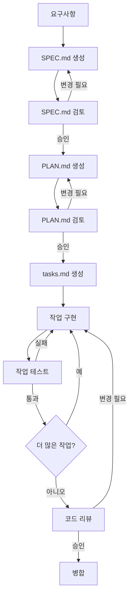

# Spec-Kit 방법론 가이드

Spec-Kit 방법론을 사용한 명세 주도 개발(SDD)에 대한 종합 가이드입니다.

## 목차

1. [소개](#소개)
2. [핵심 개념](#핵심-개념)
3. [문서 유형](#문서-유형)
4. [워크플로우](#워크플로우)
5. [모범 사례](#모범-사례)
6. [AI와 작업하기](#ai와-작업하기)

## 소개

### Spec-Kit이란?

Spec-Kit은 **명세를 소프트웨어 개발 프로세스의 중심**에 두는 개발 방법론입니다. 먼저 코드를 작성하고 나중에 문서화하는 대신:

1. 무엇을 구축할지 **명세** (SPEC.md)
2. 어떻게 구축할지 **계획** (PLAN.md)
3. 작업을 **분류** (tasks.md)
4. AI 지원으로 **구현**
5. 인수 조건에 대해 **검증**
6. 결과를 **문서화**

### 왜 Spec-Kit인가?

**전통적인 접근 방식의 문제점**:
- ❌ 코드 작성 후 명세 작성 (있다면)
- ❌ 불명확한 요구사항으로 재작업 발생
- ❌ AI가 효과적으로 지원하기 어려움
- ❌ 구현 전 검토 어려움
- ❌ 문서와 동기화되지 않음

**Spec-Kit의 이점**:
- ✅ 코딩 전 명확한 요구사항
- ✅ AI가 상세한 명세에서 생성 가능
- ✅ 검토 가능한 설계 결정
- ✅ 살아있는 문서
- ✅ 추적 가능한 개발 히스토리
- ✅ IDE, 에디터, AI 도구에 종속되지 않는 범용 방법론

## 핵심 개념

### 1. 명세 우선

모든 것은 명세로 시작합니다:

```markdown
# 기능: 사용자 로그인

## 사용자 스토리
재방문 사용자로서
내 자격 증명으로 로그인하고 싶습니다
개인화된 대시보드에 접근할 수 있도록

## 인수 조건
- [ ] 사용자가 이메일과 비밀번호를 입력할 수 있음
- [ ] 잘못된 자격 증명 시 오류 메시지 표시
- [ ] 성공적인 로그인 시 대시보드로 리다이렉트
- [ ] 페이지 새로고침 시 세션 유지
```

### 2. 헌법 주도

모든 프로젝트에는 다음을 정의하는 `constitution.md`가 있습니다:
- 코딩 표준
- 아키텍처 패턴
- 테스트 요구사항
- 보안 지침

AI와 개발자 모두 이 규칙을 따라야 합니다.

### 3. AI 지원 구현

AI 어시스턴트는 명세를 사용하여:
- 구현 계획 생성
- 패턴에 따른 코드 작성
- 테스트 생성
- 문서 업데이트

### 4. 반복적 개선

명세는 학습하면서 진화합니다:
1. 초기 명세 작성
2. 피드백 받기
3. 명세 개선
4. 구현
5. 학습 내용을 바탕으로 명세 업데이트

## 문서 유형

### SPEC.md - 기능 명세

**목적**: 무엇과 왜를 정의  
**생성 시점**: 기능 구상 시  
**업데이트 시점**: 요구사항 변경 시

**주요 섹션**:
```markdown
# 기능 이름

## 개요
간략한 설명과 목적

## 사용자 스토리
[역할]로서, [행동]을 원합니다, [이점]을 위해

## 요구사항
### 기능적 요구사항
- FR1: 구체적인 요구사항
- FR2: 또 다른 요구사항

### 비기능적 요구사항
- 성능: < 200ms 응답
- 보안: 저장 시 암호화

## 인수 조건
- [ ] 테스트 가능한 기준 1
- [ ] 테스트 가능한 기준 2

## 데이터 모델
엔티티와 관계

## API
엔드포인트 정의

## 엣지 케이스
비정상적인 상황 처리 방법
```

**모범 사례**:
- 구체적이고 측정 가능하게
- 사용자 관점 포함
- 명확한 인수 조건 정의
- 엣지 케이스 고려
- 최신 상태 유지

### PLAN.md - 구현 계획

**목적**: 어떻게를 정의  
**생성 시점**: SPEC.md 승인 후  
**업데이트 시점**: 구현 방식 변경 시

**주요 섹션**:
```markdown
# 구현 계획: 기능 이름

## 아키텍처
고수준 설계와 패턴

## 컴포넌트
### 컴포넌트 1: 인증 서비스
생성/수정할 파일

### 컴포넌트 2: 데이터베이스 스키마
필요한 스키마 변경

## 구현 단계
추정치가 포함된 단계별 접근

## 의존성
외부 패키지와 내부 모듈

## 테스트 전략
단위, 통합, E2E 테스트

## 보안 조치
인증, 검증 등

## 검증 계획
성공 검증 방법
```

**모범 사례**:
- 프로젝트 헌법 준수
- 논리적 컴포넌트로 분류
- 각 단계의 노력 추정
- 조기에 위험 식별
- 처음부터 테스트 계획

### tasks.md - 작업 분류

**목적**: 세분화된 체크리스트  
**생성 시점**: PLAN.md에서  
**업데이트 시점**: 작업 완료 시

**형식**:
```markdown
# 작업: 기능 이름

## 1단계: 설정
- [ ] 디렉토리 구조 생성
- [ ] 의존성 설치: express, jsonwebtoken
- [ ] 데이터베이스 마이그레이션 설정

## 2단계: 구현
- [ ] User 모델 생성
- [ ] AuthService.login() 구현
- [ ] bcrypt로 비밀번호 해싱 추가
- [ ] /auth/login 엔드포인트 생성

## 3단계: 테스트
- [ ] AuthService 단위 테스트
- [ ] 로그인 흐름 통합 테스트
- [ ] 오류 시나리오 테스트
- [ ] >80% 커버리지 달성

## 4단계: 문서화
- [ ] API 문서 업데이트
- [ ] README에 사용 예제 추가
```

**모범 사례**:
- 작업을 원자적으로 (각 1-2시간)
- 의존성 순서로 정렬
- 테스트 작업 포함
- 완료 시 `[x]`로 표시
- 진행하면서 업데이트

### constitution.md - 프로젝트 규칙

**목적**: 표준과 원칙 정의  
**생성 시점**: 프로젝트 시작 시  
**업데이트 시점**: 드물게 (기본적인 변경만)

**상속**:
```
조직 헌법 (전역, 선택)
    ↓
프로젝트 헌법 (전역 확장)
    ↓
기능 명세 (둘 다 따름)
```

**주요 섹션**:
- 핵심 원칙
- 코딩 표준
- 테스트 요구사항
- Git 워크플로우
- 아키텍처 지침
- 보안 규칙

### data-model.md - 데이터 구조

**목적**: 데이터 엔티티와 관계 정의  
**생성 시점**: 데이터 중심 기능용  
**업데이트 시점**: 스키마 변경 시

**예시**:
```markdown
# 데이터 모델: 사용자 인증

## 엔티티

### User
- id: UUID (기본 키)
- email: string (고유, 인덱싱)
- password_hash: string
- created_at: timestamp
- last_login: timestamp

### Session
- id: UUID (기본 키)
- user_id: UUID (외래 키 → User.id)
- token: string (인덱싱)
- expires_at: timestamp
- created_at: timestamp

## 관계
- User (1) → (N) Session
- User.id = Session.user_id

## 인덱스
- User: email (고유)
- Session: token, user_id

## 제약 조건
- 이메일은 유효한 형식이어야 함
- 비밀번호는 해싱되어야 함 (평문 금지)
- 세션은 24시간 후 만료
```

### research.md - 기술 연구

**목적**: 기술 결정 문서화  
**생성 시점**: 옵션 평가 시  
**업데이트 시점**: 연구 진행 시

**예시**:
```markdown
# 연구: 인증 라이브러리

## 옵션

### 옵션 1: Passport.js
**장점**:
- 널리 사용됨
- 많은 전략 사용 가능
- 좋은 문서화

**단점**:
- 우리 필요에 비해 무거움
- 복잡한 설정

### 옵션 2: jsonwebtoken
**장점**:
- 가벼움
- 간단한 API
- 유연함

**단점**:
- 수동 구현 필요
- 기본 기능 부족

## 벤치마크
| 라이브러리 | 번들 크기 | 성능 |
|---------|-------------|-------------|
| Passport | 45 KB | 500 req/s |
| jsonwebtoken | 12 KB | 800 req/s |

## 결정
단순성과 성능을 위해 jsonwebtoken 사용.

## 근거
인증 요구사항이 단순함 (JWT 토큰만).
작은 번들 크기와 더 나은 성능이
추가 구현 노력을 정당화함.
```

## 워크플로우

### 완전한 기능 개발 흐름



### 단계별 프로세스

#### 1. 아이디어 단계
- 필요성 또는 요구사항 식별
- 이해관계자와 논의
- 범위와 제약 명확화

#### 2. 명세 단계
```bash
# 기능 디렉토리 생성
mkdir -p specs/feature-name

# 명세 파일 생성
touch specs/feature-name/SPEC.md

# 명세 편집
# (선호하는 에디터로 열기)
```

**작성 내용**:
- 사용자 스토리
- 요구사항
- 인수 조건
- 데이터 모델 (필요시)
- API (해당시)

**검토 받기**:
- 팀과 공유
- 이해관계자 승인 받기
- 피드백 기반 개선

#### 3. 계획 단계
```bash
# 계획 파일 생성
touch specs/feature-name/PLAN.md

# 또는 AI에게 요청
# "specs/feature-name/SPEC.md에 대한 구현 계획을 생성하세요"
```

**정의 내용**:
- 아키텍처 접근 방식
- 생성/수정할 컴포넌트
- 기술 선택 (헌법 확인!)
- 테스트 전략
- 보안 조치

**확인 사항**:
- constitution.md 준수
- 모든 요구사항 처리
- 위험 식별
- 합리적인 추정

#### 4. 작업 분류
```
specs/feature-name/PLAN.md에서 tasks.md 생성
작은, 실행 가능한 작업으로 분류
```

**확인 사항**:
- 작업이 원자적임 (1-2시간)
- 의존성이 명확함
- 테스트 포함됨
- 문서화 계획됨

#### 5. 구현 단계
```
tasks.md의 각 작업에 대해:
    PLAN.md에 따라 작업 구현
    테스트 작성 (TDD)
    문서 업데이트
    작업 완료 표시
```

**AI와 작업**:
```
specs/feature-name/tasks.md의 작업 3을 구현하세요:
"AuthService.login() 메서드 생성"

PLAN.md 섹션 2.1의 설계를 따르세요
constitution.md의 코딩 표준을 준수하세요
SPEC.md에 명시된 오류 처리를 포함하세요
```

#### 6. 검증 단계
```bash
# 모든 테스트 실행
npm test  # 또는 해당 테스트 명령

# 커버리지 확인
npm run test:coverage

# 코드 린트
npm run lint
```

**SPEC.md와 비교 검증**:
- 모든 인수 조건 충족?
- 엣지 케이스 처리?
- 성능 허용 가능?
- 보안 조치 적용?

#### 7. 문서화 단계
```
업데이트:
- README.md (사용자에게 보이는 새 기능 시)
- API 문서 (API 변경 시)
- 아키텍처 문서 (구조 변경 시)
- 인라인 주석 (복잡한 로직용)
```

#### 8. 검토 단계
```
풀 리퀘스트 생성:
- SPEC.md 링크
- PLAN.md 참조
- 변경 사항 요약
- 테스트 결과 표시
- 스크린샷 포함 (UI의 경우)
```

**검토자 확인 사항**:
- SPEC.md 요구사항과 일치
- PLAN.md 설계 따름
- constitution.md 준수
- 테스트 포괄적
- 문서 업데이트됨

#### 9. 배포 단계
```
승인 후:
- 메인 브랜치에 병합
- 스테이징에 배포
- 스테이징 환경에서 검증
- 프로덕션에 배포
- 문제 모니터링
```

## 모범 사례

### 훌륭한 명세 작성

✅ **해야 할 것**:
- 사용자 관점에서 시작
- 구체적이고 측정 가능하게
- 구체적인 예시 포함
- 명확한 인수 조건 정의
- 사전에 엣지 케이스 고려

❌ **하지 말아야 할 것**:
- 모호하거나 애매하게
- 비기능적 요구사항 건너뛰기
- 오류 케이스 잊기
- 인수 조건 불명확하게

### 효과적인 계획 생성

✅ **해야 할 것**:
- 헌법 지침 따르기
- 논리적 컴포넌트로 분류
- 현실적으로 노력 추정
- 처음부터 테스트 포함
- 조기에 위험 식별

❌ **하지 말아야 할 것**:
- 아키텍처 설계 건너뛰기
- 의존성 잊기
- 보안 고려사항 무시
- 복잡성 과소평가

### 작업 관리

✅ **해야 할 것**:
- 작업을 원자적으로
- 진행하면서 업데이트
- 필요시 재추정
- 테스트 작업 포함

❌ **하지 말아야 할 것**:
- 거대한 작업 생성
- 오래된 작업 방치
- 문서화 작업 건너뛰기

## AI와 작업하기

### 효과적인 AI 프롬프트

**좋은 프롬프트**:
```
specs/user-auth/SPEC.md에 명시된 사용자 인증 기능에 대한
구현 계획을 생성하세요.

constitution.md의 프로젝트 헌법을 따르세요.
토큰에 JWT를 사용하세요. 사용자와 세션에 대한 데이터베이스 스키마를 포함하세요.
단위 테스트, 통합 테스트, E2E 테스트를 계획하세요.
```

**나쁜 프롬프트**:
```
인증 만들어줘
```

### AI 워크플로우

1. **명세 생성**:
```
[기능 설명]에 대한 명세를 SPEC.md 형식으로 작성하세요
```

2. **계획 생성**:
```
specs/[feature]/SPEC.md에 대한 구현 계획을 생성하세요
constitution.md 준수 여부를 확인하세요
```

3. **작업 분류**:
```
specs/[feature]/PLAN.md를 tasks.md 형식의
세분화된 작업으로 분류하세요
```

4. **구현**:
```
specs/[feature]/tasks.md의 작업 [N]을 구현하세요
PLAN.md와 constitution.md를 따르세요
```

5. **테스트**:
```
SPEC.md의 모든 시나리오를 커버하는
[컴포넌트]에 대한 종합 테스트를 작성하세요
```

### AI 모범 사례

- 항상 컨텍스트 제공 (SPEC, PLAN, 헌법)
- 특정 섹션 참조
- 제약 조건 명시적으로
- AI 출력 신중히 검토
- 반복하고 개선

---

**다음 단계**:
- 작은 기능으로 연습
- [best-practices.md](./best-practices.md) 검토
- 예제 프로젝트 탐색
