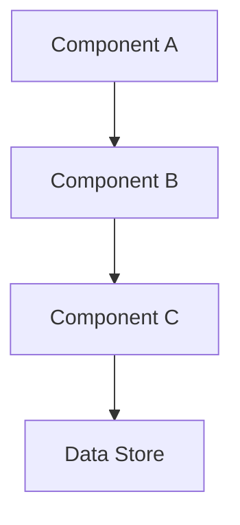
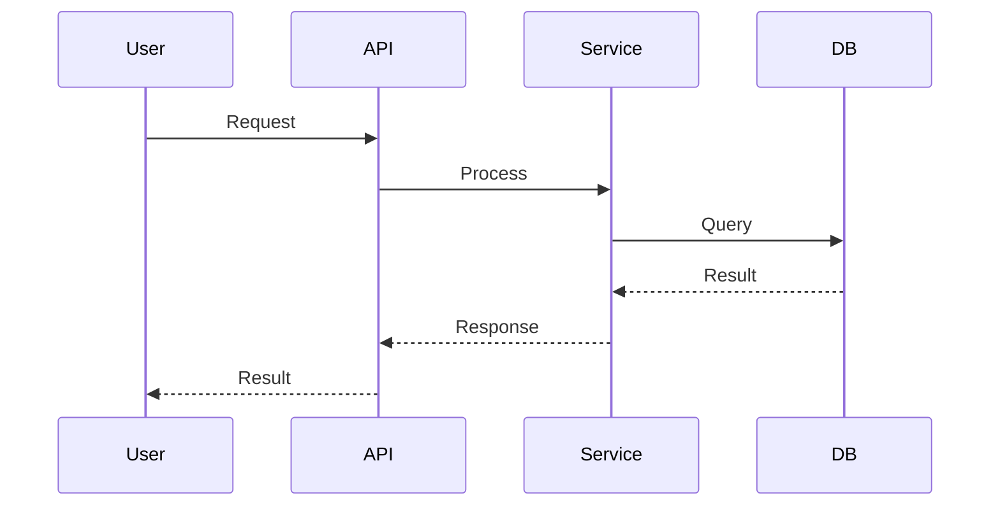

# Implementation Plan: [Feature Name]

> Technical implementation plan for [feature name]

## Goal

[Brief description of what will be implemented and why]

## Compliance Check

This implementation plan has been verified against the project constitution:
- [x] Follows coding standards
- [x] Adheres to testing strategy
- [x] Complies with security guidelines
- [x] Maintains architectural principles

## Architecture Overview

### High-Level Design



### Technology Stack

| Component | Technology | Justification |
|-----------|-----------|---------------|
| [Component 1] | [Technology] | [Why chosen] |
| [Component 2] | [Technology] | [Why chosen] |

### Design Patterns

- **Pattern 1**: [Where and why it's used]
- **Pattern 2**: [Where and why it's used]

## Proposed Changes

### Component 1: [Component Name]

**Purpose**: [What this component does]

#### New Files

##### `src/[path]/file1.js`
**Purpose**: [What this file contains]  
**Key Functions**:
- `functionName()`: [Description]
- `anotherFunction()`: [Description]

##### `src/[path]/file2.js`
**Purpose**: [What this file contains]  
**Key Classes**:
- `ClassName`: [Description]

#### Modified Files

##### `src/[path]/existing-file.js`
**Changes**:
- Add new method `methodName()`: [Purpose]
- Refactor `existingMethod()`: [Reason]
- Update imports to include [new dependency]

---

### Component 2: [Component Name]

**Purpose**: [What this component does]

#### New Files

##### `src/[path]/file3.js`
[Description of file and its contents]

---

### Component 3: Database Schema

#### New Tables

```sql
CREATE TABLE feature_table (
  id SERIAL PRIMARY KEY,
  name VARCHAR(255) NOT NULL,
  created_at TIMESTAMP DEFAULT CURRENT_TIMESTAMP
);
```

#### Schema Migrations

**Migration Name**: `001_add_feature_table`
```sql
-- Up migration
ALTER TABLE existing_table ADD COLUMN new_field VARCHAR(100);

-- Down migration
ALTER TABLE existing_table DROP COLUMN new_field;
```

---

### Component 4: API Layer

#### New Endpoints

**GET /api/resource**
- Controller: `ResourceController.get()`
- Service: `ResourceService.find()`
- Validation: `ResourceValidator.validate()`

**POST /api/resource**
- Controller: `ResourceController.create()`
- Service: `ResourceService.create()`
- Validation: `ResourceValidator.validateCreate()`

---

### Component 5: Testing

#### Unit Tests

**File**: `tests/unit/resource.test.js`
- Test `ResourceService.create()` with valid data
- Test `ResourceService.create()` with invalid data
- Test `ResourceService.find()` returns correct results

#### Integration Tests

**File**: `tests/integration/resource-api.test.js`
- Test POST /api/resource creates resource
- Test GET /api/resource retrieves resource
- Test error handling for invalid requests

#### E2E Tests

**File**: `tests/e2e/resource-flow.test.js`
- Test complete user flow from creation to retrieval

## Implementation Steps

### Phase 1: Setup & Foundation
1. [ ] Create directory structure
2. [ ] Set up database migration
3. [ ] Install new dependencies
4. [ ] Create base interfaces/types

**Estimated Time**: [X hours/days]

### Phase 2: Core Implementation
5. [ ] Implement data models
6. [ ] Create service layer
7. [ ] Implement business logic
8. [ ] Add validation

**Estimated Time**: [X hours/days]

### Phase 3: API & Integration
9. [ ] Create API controllers
10. [ ] Set up routing
11. [ ] Implement error handling
12. [ ] Add authentication/authorization

**Estimated Time**: [X hours/days]

### Phase 4: Testing
13. [ ] Write unit tests
14. [ ] Write integration tests
15. [ ] Write E2E tests
16. [ ] Achieve target coverage

**Estimated Time**: [X hours/days]

### Phase 5: Documentation & Deployment
17. [ ] Update API documentation
18. [ ] Update user documentation
19. [ ] Create deployment scripts
20. [ ] Deploy to staging

**Estimated Time**: [X hours/days]

## Dependencies

### External Dependencies

```json
{
  "package-name": "^version",
  "another-package": "^version"
}
```

**Justification**: [Why these dependencies are needed]

### Internal Dependencies

- **Module A**: Required for [reason]
- **Module B**: Required for [reason]

### Prerequisite Features

- Feature X must be completed first
- Feature Y provides required functionality

## Data Flow



## Error Handling

### Error Types

| Error Code | Description | Handling Strategy |
|------------|-------------|-------------------|
| ERR_001 | Invalid input | Return 400 with validation details |
| ERR_002 | Not found | Return 404 with resource info |
| ERR_003 | Server error | Return 500, log details |

### Logging Strategy

- **Debug**: Internal state changes
- **Info**: Successful operations
- **Warn**: Recoverable errors
- **Error**: Unrecoverable errors with stack traces

## Security Measures

- [ ] Input validation on all endpoints
- [ ] SQL injection prevention (parameterized queries)
- [ ] XSS prevention (output encoding)
- [ ] Authentication required for sensitive operations
- [ ] Authorization checks per user role
- [ ] Rate limiting on public endpoints
- [ ] Secure error messages (no sensitive info leak)

## Performance Optimization

### Expected Performance

- Response time: < [X]ms for [Y]% of requests
- Throughput: [N] requests per second
- Database queries: < [X]ms average

### Optimization Techniques

- Database indexing on [fields]
- Caching strategy for [data]
- Pagination for large result sets
- Lazy loading for [resources]

## Rollback Plan

### If Issues Are Found

1. **Revert database migrations**
   ```bash
   npm run migrate:rollback
   ```

2. **Revert code**
   ```bash
   git revert [commit-hash]
   ```

3. **Clear caches**
   ```bash
   npm run cache:clear
   ```

4. **Notify stakeholders**
   [Communication plan]

## Verification Plan

### Automated Tests

```bash
# Run all tests
npm test

# Run specific test suites
npm run test:unit
npm run test:integration
npm run test:e2e

# Check coverage
npm run test:coverage
```

**Success Criteria**:
- All tests pass
- Coverage > [X]%
- No critical linting errors

### Manual Verification

1. **Functional Testing**
   - [ ] Test happy path scenarios
   - [ ] Test edge cases
   - [ ] Test error conditions

2. **Performance Testing**
   - [ ] Load test with [N] concurrent users
   - [ ] Measure response times
   - [ ] Check database query performance

3. **Security Testing**
   - [ ] Test authentication bypass attempts
   - [ ] Test SQL injection vectors
   - [ ] Test XSS vulnerabilities

4. **Integration Testing**
   - [ ] Verify integration with dependent services
   - [ ] Test data consistency across systems

### Deployment Verification

1. Deploy to staging environment
2. Run smoke tests
3. Verify logs show no errors
4. Check monitoring dashboards
5. Get stakeholder approval
6. Deploy to production
7. Monitor for 24 hours

## Open Issues

- [ ] [Issue 1 that needs resolution]
- [ ] [Issue 2 that needs resolution]

## References

- [SPEC.md](./SPEC.md)
- [Project Constitution](../constitution.md)
- [Architecture Documentation]
- [API Documentation]

---

**Status**: Draft | In Review | Approved | In Progress | Completed  
**Author**: [Name]  
**Created**: [Date]  
**Last Updated**: [Date]  
**Reviewers**: [Names]  
**Estimated Effort**: [Total hours/days]
