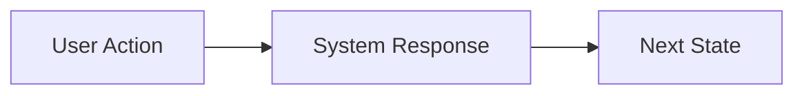

# Feature Name

> Brief one-line description of the feature

## Overview

### Purpose
[Explain why this feature is needed. What problem does it solve?]

### Scope
[What is included in this feature and what is explicitly out of scope?]

## User Stories

### Primary User Story
**As a** [user type]  
**I want to** [action]  
**So that** [benefit]

### Additional User Stories
1. **As a** [user type], **I want to** [action], **so that** [benefit]
2. **As a** [user type], **I want to** [action], **so that** [benefit]

## Requirements

### Functional Requirements

#### FR1: [Requirement Name]
**Description**: [Detailed description]  
**Priority**: High/Medium/Low  
**Dependencies**: [Any dependencies]

#### FR2: [Requirement Name]
**Description**: [Detailed description]  
**Priority**: High/Medium/Low  
**Dependencies**: [Any dependencies]

### Non-Functional Requirements

#### NFR1: Performance
- [Specific performance requirement]

#### NFR2: Security
- [Specific security requirement]

#### NFR3: Usability
- [Specific usability requirement]

## User Interface (if applicable)

### Wireframes/Mockups
[Link to or embed wireframes]

### User Flows


### Interactions
[Describe key user interactions]

## Data Model

### Entities
[List main entities involved]

### Relationships
[Describe relationships between entities]

### Schema Changes (if any)
```sql
-- Example schema changes
CREATE TABLE example (
  id INT PRIMARY KEY,
  name VARCHAR(255)
);
```

## APIs / Interfaces

### New Endpoints

#### POST /api/resource
**Description**: [What this endpoint does]  
**Request**:
```json
{
  "field1": "value",
  "field2": 123
}
```
**Response**:
```json
{
  "id": "123",
  "status": "success"
}
```
**Error Cases**:
- 400: Invalid input
- 404: Resource not found

### Modified Endpoints
[List any existing endpoints that will change]

## Business Logic

### Rules
1. [Business rule 1]
2. [Business rule 2]
3. [Business rule 3]

### Validations
- [Validation 1]
- [Validation 2]

### Edge Cases
1. **Case**: [Description]  
   **Expected Behavior**: [How the system should handle it]

2. **Case**: [Description]  
   **Expected Behavior**: [How the system should handle it]

## Acceptance Criteria

### Success Criteria
- [ ] [Criterion 1]
- [ ] [Criterion 2]
- [ ] [Criterion 3]

### Testing Scenarios

#### Scenario 1: Happy Path
**Given** [initial state]  
**When** [action]  
**Then** [expected result]

#### Scenario 2: Error Handling
**Given** [initial state]  
**When** [error condition]  
**Then** [expected error handling]

#### Scenario 3: Edge Case
**Given** [edge case setup]  
**When** [action]  
**Then** [expected behavior]

## Dependencies

### Technical Dependencies
- [Library/Service 1]: [Why it's needed]
- [Library/Service 2]: [Why it's needed]

### Feature Dependencies
- [Feature/Module 1]: [Why it's needed]
- [Feature/Module 2]: [Why it's needed]

## Security Considerations

- [Security consideration 1]
- [Security consideration 2]
- [Security consideration 3]

## Performance Considerations

- [Performance consideration 1]
- [Performance consideration 2]

## Migration & Rollout

### Migration Plan (if applicable)
[How to migrate existing data or users to the new feature]

### Feature Flags
[If using feature flags, describe the rollout strategy]

### Rollback Plan
[How to rollback if something goes wrong]

## Risks & Mitigations

| Risk | Impact | Probability | Mitigation |
|------|--------|-------------|------------|
| [Risk 1] | High/Med/Low | High/Med/Low | [How to mitigate] |
| [Risk 2] | High/Med/Low | High/Med/Low | [How to mitigate] |

## Open Questions

- [ ] [Question 1]
- [ ] [Question 2]
- [ ] [Question 3]

## References

- [Link to related documentation]
- [Link to design resources]
- [Link to research]

---

**Status**: Draft | In Review | Approved | In Progress | Completed  
**Author**: [Name]  
**Created**: [Date]  
**Last Updated**: [Date]  
**Reviewers**: [Names]
